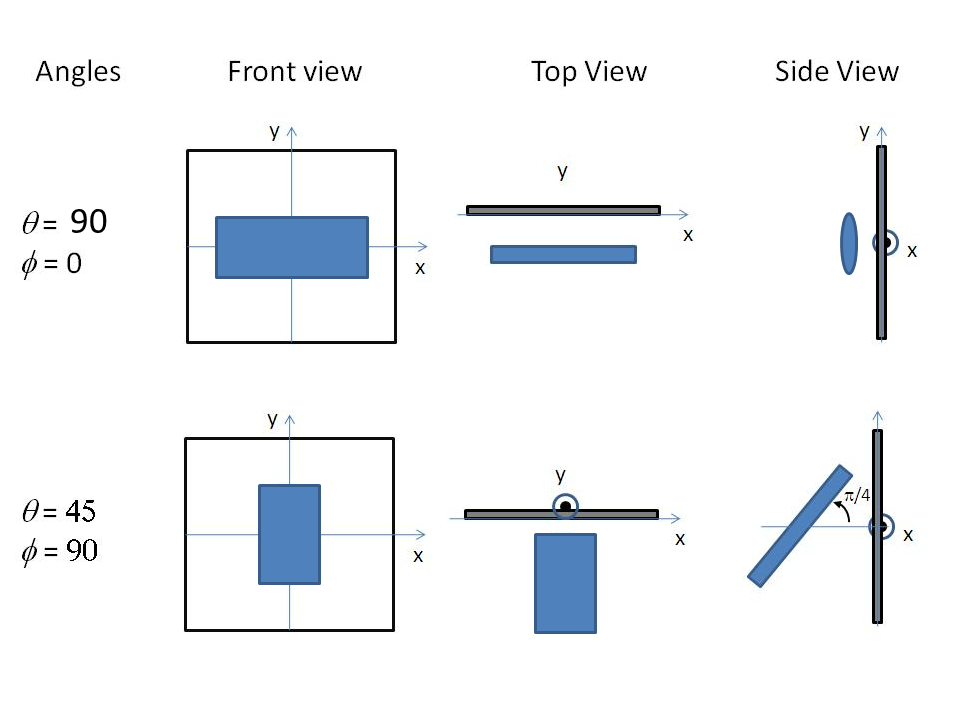

.. _orientation:

Oriented particles
==================

With two dimensional small angle diffraction data sasmodels will calculate
scattering from oriented particles, applicable for example to shear flow
or orientation in a magnetic field.

In general we first need to define the reference orientation
of the particle's $a$-$b$-$c$ axes with respect to the incoming
neutron or X-ray beam. This is done using three angles: $\theta$ and $\phi$
define the orientation of the $c$-axis of the particle, and angle $\Psi$ is
defined as the orientation of the major axis of the particle cross section
with respect to its starting position along the beam direction (or
equivalently, as rotation about the $c$ axis). There is an unavoidable
ambiguity when $c$ is aligned with $z$ in that $\phi$ and $\Psi$ both
serve to rotate the particle about $c$, but this symmetry is destroyed
when $\theta$ is not a multiple of 180.

The figures below are for an elliptical cross section cylinder, but may
be applied analogously to other shapes of particle.

.. note::
    It is very important to note that these angles, in particular $\theta$
    and $\phi$, are NOT in general the same as the $\theta$ and $\phi$
    appearing in equations for the scattering form factor which gives the
    scattered intensity or indeed in the equation for scattering vector $Q$.
    The $\theta$ rotation must be applied before the $\phi$ rotation, else
    there is an ambiguity.

.. figure::
    orient_img/elliptical_cylinder_angle_definition.png

    Definition of angles for oriented elliptical cylinder, where axis_ratio
    b/a is shown >1. Note that rotation $\theta$, initially in the $x$-$z$
    plane, is carried out first, then rotation $\phi$ about the $z$-axis,
    finally rotation $\Psi$ is around the axis of the cylinder. The neutron
    or X-ray beam is along the $-z$ axis.

    Some examples of the orientation angles for an elliptical cylinder,
    with $\Psi$ = 0.

Having established the mean direction of the particle (the view) we can then
apply angular orientation distributions (jitter). This is done by a numerical
integration over a range of angles in a similar way to particle size
dispersity. The orientation dispersity is defined with respect to the
$a$-$b$-$c$ axes of the particle, with roll angle $\Psi$ about the $c$-axis,
yaw angle $\theta$ about the $b$-axis and pitch angle $\phi$ about the
$a$-axis.

You can explore the view and jitter angles interactively using
:func:`sasmodels.jitter.run`.  Enter the following into the python
interpreter::

    from sasmodels import jitter
    jitter.run()

More formally, starting with axes $a$-$b$-$c$ of the particle aligned
with axes $x$-$y$-$z$ of the laboratory frame, the orientation dispersity
is applied first, using the
`Tait-Bryan <https://en.wikipedia.org/wiki/Euler_angles#Conventions_2>`_
$x$-$y'$-$z''$ convention with angles $\Delta\phi$-$\Delta\theta$-$\Delta\Psi$.
The reference orientation then follows, using the
`Euler angles <https://en.wikipedia.org/wiki/Euler_angles#Conventions>`_
$z$-$y'$-$z''$ with angles $\phi$-$\theta$-$\Psi$.  This is implemented
using rotation matrices as

.. math::

    R = R_z(\phi)\, R_y(\theta)\, R_z(\Psi)\,
        R_x(\Delta\phi)\, R_y(\Delta\theta)\, R_z(\Delta\Psi)

To transform detector $(q_x, q_y)$ values into $(q_a, q_b, q_c)$ for the
shape in its canonical orientation, use

.. math::

    [q_a, q_b, q_c]^T = R^{-1} \, [q_x, q_y, 0]^T

The inverse rotation is easily calculated by rotating the opposite directions
in the reverse order, so

.. math::

    R^{-1} = R_z(-\Delta\Psi)\, R_y(-\Delta\theta)\, R_x(-\Delta\phi)\,
             R_z(-\Psi)\, R_y(-\theta)\, R_z(-\phi)

The $\theta$ and $\phi$ orientation parameters for the cylinder only appear
when fitting 2d data. On introducing "Orientational Distribution" in the
angles, "distribution of theta" and "distribution of phi" parameters will
appear. These are actually rotations about the axes $\delta_1$ and $\delta_2$
of the cylinder, which correspond to the $b$ and $a$ axes of the cylinder
cross section. (When $\theta = \phi = 0$ these are parallel to the $Y$ and
$X$ axes of the instrument.) The third orientation distribution, in $\Psi$,
is about the $c$ axis of the particle. Some experimentation may be required
to understand the 2d patterns fully. A number of different shapes of
distribution are available, as described for size dispersity, see
:ref:`polydispersityhelp`.

Given that the angular dispersion distribution is defined in cartesian space,
over a cube defined by

.. math::

    [-\Delta \theta, \Delta \theta] \times
    [-\Delta \phi, \Delta \phi] \times
    [-\Delta \Psi, \Delta \Psi]

but the orientation is defined over a sphere, we are left with a
`map projection <https://en.wikipedia.org/wiki/List_of_map_projections>`_
problem, with different tradeoffs depending on how values in $\Delta\theta$
and $\Delta\phi$ are translated into latitude/longitude on the sphere.

Sasmodels is using the
`equirectangular projection <https://en.wikipedia.org/wiki/Equirectangular_projection>`_.
In this projection, square patches in angular dispersity become wedge-shaped
patches on the sphere. To correct for the changing point density, there is a
scale factor of $\sin(\Delta\theta)$ that applies to each point in the
integral. This is not enough, though. Consider a shape which is tumbling
freely around the $b$ axis, with $\Delta\theta$ uniform in $[-180, 180]$. At
$\pm 90$, all points in $\Delta\phi$ map to the pole, so the jitter will have
a distinct angular preference. If the spin axis is along the beam (which
will be the case for $\theta=90$ and $\Psi=90$) the scattering pattern
should be circularly symmetric, but it will go to zero at $q_x = 0$ due to the
$\sin(\Delta\theta)$ correction. This problem does not appear for a shape
that is tumbling freely around the $a$ axis, with $\Delta\phi$ uniform in
$[-180, 180]$, so swap the $a$ and $b$ axes so $\Delta\theta < \Delta\phi$
and adjust $\Psi$ by 90. This works with the current sasmodels shapes due to
symmetry.

Alternative projections were considered.
The `sinusoidal projection <https://en.wikipedia.org/wiki/Sinusoidal_projection>`_
works by scaling $\Delta\phi$ as $\Delta\theta$ increases, and dropping those
points outside $[-180, 180]$. The distortions are a little less for middle
ranges of $\Delta\theta$, but they are still severe for large $\Delta\theta$
and the model is much harder to explain.
The `azimuthal equidistance projection <https://en.wikipedia.org/wiki/Azimuthal_equidistant_projection>`_
also improves on the equirectangular projection by extending the range of
reasonable values for the $\Delta\theta$ range, with $\Delta\phi$ forming a
wedge that cuts to the opposite side of the sphere rather than cutting to the
pole. This projection has the nice property that distance from the center are
preserved, and that $\Delta\theta$ and $\Delta\phi$ act the same.
The `azimuthal equal area projection <https://en.wikipedia.org/wiki/Lambert_azimuthal_equal-area_projection>`_
is like the azimuthal equidistance projection, but it preserves area instead
of distance. It also has the same behaviour for $\Delta\theta$ and $\Delta\phi$.
The `Guyou projection <https://en.wikipedia.org/wiki/Guyou_hemisphere-in-a-square_projection>`_
has an excellent balance with reasonable distortion in both $\Delta\theta$
and $\Delta\phi$, as well as preserving small patches. However, it requires
considerably more computational overhead, and we have not yet derived the
formula for the distortion correction, measuring the degree of stretch at
the point $(\Delta\theta, \Delta\phi)$ on the map.

.. note::
    Note that the form factors for oriented particles are performing
    numerical integrations over one or more variables, so care should be
    taken, especially with very large particles or more extreme aspect
    ratios. In such cases results may not be accurate, particularly at very
    high Q, unless the model has been specifically coded to use limiting
    forms of the scattering equations.

    For best numerical results keep the $\theta$ distribution narrower than
    the $\phi$ distribution. Thus for asymmetric particles, such as
    elliptical_cylinder, you may need to reorder the sizes of the three axes
    to acheive the desired result. This is due to the issues of mapping a
    rectanglar distribution onto the surface of a sphere.

Users can experiment with the values of *Npts* and *Nsigs*, the number of steps
used in the integration and the range spanned in number of standard deviations.
The standard deviation is entered in units of degrees. For a "rectangular"
distribution the full width should be $\pm \sqrt(3)$ ~ 1.73 standard deviations.
The new "uniform" distribution avoids this by letting you directly specify the
half width.

The angular distributions may be truncated outside of the range -180 to +180
degrees, so beware of using saying a broad Gaussian distribution with large
value of *Nsigs*, as the array of *Npts* may be truncated to many fewer
points than would give a good integration,as well as becoming rather
meaningless. (At some point in the future the actual dispersion arrays may be
made available to the user for inspection.)

Some more detailed technical notes are provided in the developer section of
this manual :ref:`orientation_developer` .

This definition of orientation is new to SasView 4.2.  In earlier versions,
the orientation distribution appeared as a distribution of view angles.
This led to strange effects when $c$ was aligned with $z$, where changes
to the $\phi$ angle served only to rotate the shape about $c$, rather than
having a consistent interpretation as the pitch of the shape relative to
the flow field defining the reference orientation.  Prior to SasView 4.1,
the reference orientation was defined using a Tait-Bryan convention, making
it difficult to control.  Now, rotation in $\theta$ modifies the spacings
in the refraction pattern, and rotation in $\phi$ rotates it in the detector
plane.

*Document History*

| 2017-11-06 Richard Heenan
| 2017-12-20 Paul Kienzle
