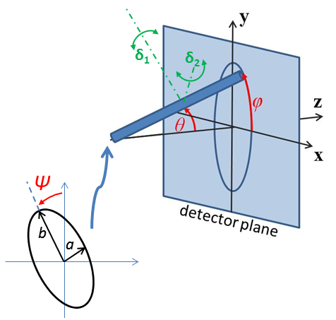

.. _orientation:

Oriented particles
==================

With two dimensional small angle diffraction data SasView will calculate
scattering from oriented particles, applicable for example to shear flow
or orientation in a magnetic field.

In general we first need to define the reference orientation
of the particles with respect to the incoming neutron or X-ray beam. This
is done using three angles: $\theta$ and $\phi$ define the orientation of
the axis of the particle, angle $\Psi$ is defined as the orientation of
the major axis of the particle cross section with respect to its starting
position along the beam direction. The figures below are for an elliptical
cross section cylinder, but may be applied analogously to other shapes of
particle.

.. note::
    It is very important to note that these angles, in particular $\theta$
    and $\phi$, are NOT in general the same as the $\theta$ and $\phi$
    appearing in equations for the scattering form factor which gives the
    scattered intensity or indeed in the equation for scattering vector $Q$.
    The $\theta$ rotation must be applied before the $\phi$ rotation, else
    there is an ambiguity.

    Definition of angles for oriented elliptical cylinder, where axis_ratio
    b/a is shown >1, Note that rotation $\theta$, initially in the $x$-$z$
    plane, is carried out first, then rotation $\phi$ about the $z$-axis,
    finally rotation $\Psi$ is around the axis of the cylinder. The neutron
    or X-ray beam is along the $z$ axis.

.. figure::
    orient_img/elliptical_cylinder_angle_projection.png

    Some examples of the orientation angles for an elliptical cylinder,
    with $\Psi$ = 0.

Having established the mean direction of the particle we can then apply
angular orientation distributions. This is done by a numerical integration
over a range of angles in a similar way to particle size dispersity.
In the current version of sasview the orientational dispersity is defined
with respect to the axes of the particle.

The $\theta$ and $\phi$ orientation parameters for the cylinder only appear
when fitting 2d data. On introducing "Orientational Distribution" in
the angles, "distribution of theta" and "distribution of phi" parameters will
appear. These are actually rotations about the axes $\delta_1$ and $\delta_2$
of the cylinder, the $b$ and $a$ axes of the cylinder cross section. (When
$\theta = \phi = 0$ these are parallel to the $Y$ and $X$ axes of the
instrument.) The third orientation distribution, in $\Psi$, is about the $c$
axis of the particle. Some experimentation may be required to understand the
2d patterns fully. A number of different shapes of distribution are
available, as described for polydispersity, see :ref:`polydispersityhelp` .

Earlier versions of SasView had numerical integration issues in some
circumstances when distributions passed through 90 degrees. The distributions
in particle coordinates are more robust, but should still be approached with
care for large ranges of angle.

.. note::
    Note that the form factors for oriented particles are also performing
    numerical integrations over one or more variables, so care should be taken,
    especially with very large particles or more extreme aspect ratios. In such 
    cases results may not be accurate, particularly at very high Q, unless the model
    has been specifically coded to use limiting forms of the scattering equations.
    
    For best numerical results keep the $\theta$ distribution narrower than the $\phi$ 
    distribution. Thus for asymmetric particles, such as elliptical_cylinder, you may 
    need to reorder the sizes of the three axes to acheive the desired result. 
    This is due to the issues of mapping a rectangular distribution onto the 
    surface of a sphere.

Users can experiment with the values of *Npts* and *Nsigs*, the number of steps 
used in the integration and the range spanned in number of standard deviations. 
The standard deviation is entered in units of degrees. For a "rectangular" 
distribution the full width should be $\pm \sqrt(3)$ ~ 1.73 standard deviations. 
The new "uniform" distribution avoids this by letting you directly specify the 
half width.

The angular distributions will be truncated outside of the range -180 to +180 
degrees, so beware of using saying a broad Gaussian distribution with large value
of *Nsigs*, as the array of *Npts* may be truncated to many fewer points than would 
give a good integration,as well as becoming rather meaningless. (At some point 
in the future the actual polydispersity arrays may be made available to the user 
for inspection.)

Some more detailed technical notes are provided in the developer section of
this manual :ref:`orientation_developer` .

*Document History*

| 2017-11-06 Richard Heenan