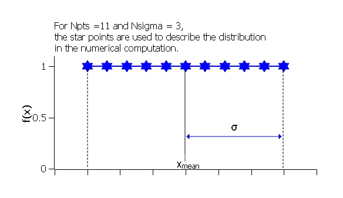

.. pd_help.rst

.. This is a port of the original SasView html help file to ReSTructured text
.. by S King, ISIS, during SasView CodeCamp-III in Feb 2015.

.. ZZZZZZZZZZZZZZZZZZZZZZZZZZZZZZZZZZZZZZZZZZZZZZZZZZZZZZZZZZZZZZZZZZZZZZZZZZZZZ

.. _polydispersityhelp:

Polydispersity & Orientational Distributions
============================================

For some models we can calculate the average intensity for a population of
particles that possess size and/or orientational (ie, angular) distributions
(see :ref:`PStheory` for more details). In SasView we call the former
*polydispersity* but use the parameter *PD* to parameterise both. In other
words, the meaning of *PD* in a model depends on the actual parameter it is
being applied too.

The resultant intensity is then normalized by the average particle volume such
that

.. math::

  P(q) = \frac{\text{scale}}{\langle V \rangle} \langle F F^* \rangle + \text{background}

where $F$ is the scattering amplitude and $\langle\cdot\rangle$ denotes an
average over the distribution $f(x; \bar x, \sigma)$, giving

.. math::

  P(q) = \frac{\text{scale}}{\langle V \rangle} \int_\mathbb{R}
  f(x; \bar x, \sigma) F^2(q, x)\, dx + \text{background}

Each distribution is characterized by a center value $\bar x$ or
$x_\text{med}$, a width parameter $\sigma$ (note this is *not necessarily*
the standard deviation, so read the description carefully), the number of
sigmas $N_\sigma$ to include from the tails of the distribution, and the
number of points used to compute the average. The center of the distribution
is set by the value of the model parameter. The meaning of a polydispersity
parameter *PD* (not to be confused with a molecular weight distributions
in polymer science) in a model depends on the type of parameter it is being
applied too.

The distribution width applied to *volume* (ie, shape-describing) parameters
is relative to the center value such that $\sigma = \mathrm{PD} \cdot \bar x$.
However, the distribution width applied to *orientation* (ie, angle-describing)
parameters is just $\sigma = \mathrm{PD}$.

$N_\sigma$ determines how far into the tails to evaluate the distribution,
with larger values of $N_\sigma$ required for heavier tailed distributions.
The scattering in general falls rapidly with $qr$ so the usual assumption
that $f(r - 3\sigma_r)$ is tiny and therefore $f(r - 3\sigma_r)f(r - 3\sigma_r)$
will not contribute much to the average may not hold when particles are large.
This, too, will require increasing $N_\sigma$.

Users should note that the averaging computation is very intensive. Applying
polydispersion and/or orientational distributions to multiple parameters at
the same time, or increasing the number of points in the distribution, will
require patience! However, the calculations are generally more robust with
more data points or more angles.

The following distribution functions are provided:

*  `Uniform Distribution`_
*  `Rectangular Distribution`_
*  `Gaussian Distribution`_
*  `Boltzmann Distribution`_
*  `Lognormal Distribution`_
*  `Schulz Distribution`_
*  `Array Distribution`_
*  `User-defined Distributions`_

These distributions define the *number density* of the given population of
scatterers. The resulting scattering is then the number average over the
distribution.

**Beware: the default distribution for all parameters is the Gaussian
Distribution but this may not be suitable. See** `Suggested Applications`_ **below.**

.. note:: In 2009 IUPAC decided to introduce the new term 'dispersity' to replace
           the term 'polydispersity' (see `Pure Appl. Chem., (2009), 81(2),
           351-353 <http://media.iupac.org/publications/pac/2009/pdf/8102x0351.pdf>`_
           in order to make the terminology describing distributions of chemical
           properties unambiguous. However, these terms are unrelated to the
           proportional size distributions and orientational distributions used in
           SasView models.

Calculation of I(q)
^^^^^^^^^^^^^^^^^^^

Let $w(r)$ be the *relative number* of particles of size $r$, **not the volume
fraction of particles**. $w(r)$ scales with the number density, $n(r)$.

The *volume fraction*, $\phi$, is the integrated volume of all particles, $V_p$,
divided by total volume, $V_t$

.. math:: 
     :label: eq1

     \phi = \frac{V_p}{V_t}

where $V_p$ is the number of particles, $N$, multiplied by the average particle volume
$\langle V(r) \rangle$

.. math::
     :label: eq2

     Vp = N \langle V(r) \rangle

The *number density* of particles, $n$, is the total number of particles divided by
the total volume

.. math::
     :label: eq3

     n = \frac{N}{V_t}

Since $w(r)$ is a distribution on the number of particles that (ideally) sums to one,
the number of particles of size $r$, $n(r)$, scales with $w(r)$ as

.. math::
     :label: eq4

     n(r) = \frac{w(r)}{\int w(r)dr} \cdot \frac{N}{V_t}

Rewriting :eq:`eq1` as $V_p =  \phi V_t$ and substituting into :eq:`eq2` gives
$\phi V_t = N \langle V(r) \rangle$ which can then be solved for $N / V_t$

.. math::
     :label: eq5

     \frac{N}{V_t} = \frac{\phi}{\langle V(r) \rangle}

Substituting :eq:`eq5` into :eq:`eq4`, we get

.. math::
     :label: eq6

     n(r) = \frac{w(r)}{\int w(r)dr} \cdot \frac{\phi}{\langle V(r) \rangle}

Since $w(r)$ is the relative number of particles of size $r$, the average volume is

.. math::
     :label: eq7

     \langle V(r) \rangle = \frac{\int w(r)V(r)dr}{\int w(r)dr}

Substituting :eq:`eq7` into :eq:`eq6` then yields

.. math::
     :label: eq8

     n(r) = w(r) \cdot  \frac{\phi}{\int w(r)V(r)dr}

Note that the second half of :eq:`eq8` is independent of $r$ and can slip out of the
integral, such that

.. math::
     :label: eq9

     I(q) = \int n(r) \langle F F^* \rangle dr
          = \frac{\phi \int w(r) \langle F F^* \rangle dr}{\int w(r)V(r) dr}

Suggested Applications
^^^^^^^^^^^^^^^^^^^^^^

If applying polydispersion to parameters describing particle sizes, consider
using the `Lognormal Distribution`_ or `Schulz Distribution`_.

If applying polydispersion to parameters describing interfacial thicknesses
or orientations, consider using the `Gaussian Distribution`_ or
`Boltzmann Distribution`_.

If applying polydispersion to parameters describing angles, use the
`Uniform Distribution`_ or a *Maier-Saupe* distribution or a *Cyclic Gaussian*
distribution. 

The `Array Distribution`_ provides a very simple means of implementing a
user-defined distribution, but without any fittable parameters. Greater
flexibility is conferred by using `User-defined Distributions`_.

Usage Notes
^^^^^^^^^^^

Beware of using distributions that are always positive (eg, the *Lognormal*) for
angles because angles can be negative! If in doubt, plot the polydispersity data
for the model and check!

The parameter bounds (ie, Min/Max) for polydispersion should be specified under the
Polydispersity tab on the FitPage. They are not formally linked to the bounds for
the parameter to which polydispersion is being applied that appear under the Model
tab. In other words, bounds on a *radius* parameter under Model are not the same as
bounds on a *distribution of radius* parameter under Polydispersity, and vice versa. 

If a distribution exceeds its parameter bounds those weights outside the bounds are
excluded and the distribution is normalized such that the sum of the remaining
weights in the truncated distribution equal one.

Whilst PD values for 'size' parameters are in proportion to the mean, with values
normally lying in the range 0 – 1, PD values for 'angular' parameters represent the
actual width of the distribution in degrees, so values as high as 5 or 10 degrees
maybe necessary to describe oriented systems. Again, plotting the relevant
polydispersity data will easily show if a sensible value is being used.

When using an `Array Distribution`_, be aware that the polydispersity parameters,
and the parameter to which the distribution is being applied, cannot be fitted.

Additional distribution functions (and, indeed models) may be found on the
`Sasview Model Marketplace <http://marketplace.sasview.org/>`_.

.. ZZZZZZZZZZZZZZZZZZZZZZZZZZZZZZZZZZZZZZZZZZZZZZZZZZZZZZZZZZZZZZZZZZZZZZZZZZZZZ

Uniform Distribution
^^^^^^^^^^^^^^^^^^^^

The Uniform Distribution is defined as

.. math::

    f(x) = \frac{1}{\text{Norm}}
    \begin{cases}
        1 & \text{for } |x - \bar x| \leq \sigma \\
        0 & \text{for } |x - \bar x| > \sigma
    \end{cases}

where $\bar x$ ($x_\text{mean}$ in the figure) is the mean of the
distribution, $\sigma$ is the half-width, and *Norm* is a normalization
factor which is determined during the numerical calculation.

The polydispersity in sasmodels is given by

.. math:: \text{PD} = \sigma / \bar x

    Uniform distribution.

The value $N_\sigma$ is ignored for this distribution.

.. ZZZZZZZZZZZZZZZZZZZZZZZZZZZZZZZZZZZZZZZZZZZZZZZZZZZZZZZZZZZZZZZZZZZZZZZZZZZZZ

Rectangular Distribution
^^^^^^^^^^^^^^^^^^^^^^^^

The Rectangular Distribution is defined as

.. math::

    f(x) = \frac{1}{\text{Norm}}
    \begin{cases}
        1 & \text{for } |x - \bar x| \leq w \\
        0 & \text{for } |x - \bar x| > w
    \end{cases}

where $\bar x$ ($x_\text{mean}$ in the figure) is the mean of the
distribution, $w$ is the half-width, and *Norm* is a normalization
factor which is determined during the numerical calculation.

Note that the standard deviation and the half width $w$ are different!

The standard deviation is

.. math:: \sigma = w / \sqrt{3}

whilst the polydispersity in sasmodels is given by

.. math:: \text{PD} = \sigma / \bar x

.. figure:: pd_rectangular.jpg

    Rectangular distribution.

.. note:: The Rectangular Distribution is deprecated in favour of the
            Uniform Distribution above and is described here for backwards
            compatibility with earlier versions of SasView only.

.. ZZZZZZZZZZZZZZZZZZZZZZZZZZZZZZZZZZZZZZZZZZZZZZZZZZZZZZZZZZZZZZZZZZZZZZZZZZZZZ

Gaussian Distribution
^^^^^^^^^^^^^^^^^^^^^

The Gaussian Distribution is defined as

.. math::

    f(x) = \frac{1}{\text{Norm}}
            \exp\left(-\frac{(x - \bar x)^2}{2\sigma^2}\right)

where $\bar x$ ($x_\text{mean}$ in the figure) is the mean of the
distribution and *Norm* is a normalization factor which is determined
during the numerical calculation.

The polydispersity in sasmodels is given by

.. math:: \text{PD} = \sigma / \bar x

.. figure:: pd_gaussian.jpg

    Normal distribution.

.. ZZZZZZZZZZZZZZZZZZZZZZZZZZZZZZZZZZZZZZZZZZZZZZZZZZZZZZZZZZZZZZZZZZZZZZZZZZZZZ

Boltzmann Distribution
^^^^^^^^^^^^^^^^^^^^^^

The Boltzmann Distribution is defined here as

.. math::

    f(x) = \frac{1}{\text{Norm}}
            \exp\left(-\frac{ | x - \bar x | }{\sigma}\right)

where $\bar x$ ($x_\text{mean}$ in the figure) is the mean of the
distribution and *Norm* is a normalization factor which is determined
during the numerical calculation. Strictly speaking, however, this
function is a Laplace Distribution, of which the Boltzmann Distribution
is but a limiting case.

The width is defined as

.. math:: \sigma=\frac{k T}{E}

which is the inverse Boltzmann factor, where $k$ is the Boltzmann constant,
$T$ the temperature in Kelvin and $E$ a characteristic energy per particle.

.. figure:: pd_boltzmann.jpg

    Boltzmann distribution.

.. ZZZZZZZZZZZZZZZZZZZZZZZZZZZZZZZZZZZZZZZZZZZZZZZZZZZZZZZZZZZZZZZZZZZZZZZZZZZZZ

Lognormal Distribution
^^^^^^^^^^^^^^^^^^^^^^

The Lognormal Distribution describes a function of $x$ where $\ln (x)$ has
a normal distribution. The result is a distribution that is skewed towards
larger values of $x$.

The Lognormal Distribution is defined as

.. math::

    f(x) = \frac{1}{\text{Norm}}\frac{1}{x\sigma}
            \exp\left(-\frac{1}{2}
                        \bigg(\frac{\ln(x) - \mu}{\sigma}\bigg)^2\right)

where *Norm* is a normalization factor which will be determined during
the numerical calculation, $\mu=\ln(x_\text{med})$ and $x_\text{med}$
is the *median* value of the *lognormal* distribution, but $\sigma$ is
a parameter describing the width of the underlying *normal* distribution.

$x_\text{med}$ will be the value given for the respective size parameter
in sasmodels, for example, *radius=60*.

The polydispersity in sasmodels is given by

.. math:: \text{PD} = \sigma = p / x_\text{med}

The mean value of the distribution is given by $\bar x = \exp(\mu+ \sigma^2/2)$
and the peak value by $\max x = \exp(\mu - \sigma^2)$.

The variance (the square of the standard deviation) of the *lognormal*
distribution is given by

.. math::

    \nu = [\exp({\sigma}^2) - 1] \exp({2\mu + \sigma^2})

Note that larger values of PD might need a larger number of points
and $N_\sigma$.

.. figure:: pd_lognormal.jpg

    Lognormal distribution for PD=0.1.

For further information on the Lognormal distribution see:

http://en.wikipedia.org/wiki/Log-normal_distribution

http://mathworld.wolfram.com/LogNormalDistribution.html

.. ZZZZZZZZZZZZZZZZZZZZZZZZZZZZZZZZZZZZZZZZZZZZZZZZZZZZZZZZZZZZZZZZZZZZZZZZZZZZZ

Schulz Distribution
^^^^^^^^^^^^^^^^^^^

The Schulz (sometimes written Schultz) distribution is similar to the
Lognormal distribution, in that it is also skewed towards larger values of
$x$, but which has computational advantages over the Lognormal distribution.

The Schulz distribution is defined as

.. math::

    f(x) = \frac{1}{\text{Norm}} (z+1)^{z+1}(x/\bar x)^z
            \frac{\exp[-(z+1)x/\bar x]}{\bar x\Gamma(z+1)}

where $\bar x$ ($x_\text{mean}$ in the figure) is the mean of the
distribution, *Norm* is a normalization factor which is determined
during the numerical calculation, and $z$ is a measure of the width
of the distribution such that

.. math:: z = (1-p^2) / p^2

where $p$ is the polydispersity in sasmodels given by

.. math:: PD = p = \sigma / \bar x

and $\sigma$ is the RMS deviation from $\bar x$.

Note that larger values of PD might need a larger number of points
and $N_\sigma$. For example, for PD=0.7 with radius=60 |Ang|, at least
Npts>=160 and Nsigmas>=15 are required.

.. figure:: pd_schulz.jpg

    Schulz distribution.

For further information on the Schulz distribution see:

`M Kotlarchyk & S-H Chen, J Chem Phys, (1983), 79, 2461 <https://doi.org/10.1063/1.446055>`_

`M Kotlarchyk, RB Stephens, and JS Huang, J Phys Chem, (1988), 92, 1533 <https://doi.org/10.1021/j100317a032>`_.

.. ZZZZZZZZZZZZZZZZZZZZZZZZZZZZZZZZZZZZZZZZZZZZZZZZZZZZZZZZZZZZZZZZZZZZZZZZZZZZZ

Array Distribution
^^^^^^^^^^^^^^^^^^

This user-definable distribution should be given as a simple ASCII text
file where the array is defined by two columns of numbers: $x$ and $f(x)$.
The $f(x)$ will be normalized to 1 during the computation.

Example of what an array distribution file should look like:

====  =====
 30    0.1
 32    0.3
 35    0.4
 36    0.5
 37    0.6
 39    0.7
 41    0.9
====  =====

.. note:: Only these array values are used for computation, any other
           polydispersity parameter values in the model have no effect and
           will be ignored when computing the average.  **This also means that
           any parameter with an array distribution cannot be fitted.**

If representing continuous distributions, it is best to use a simple rectangle
rule integration with equally spaced $x$ values and the weight $f(x)$ chosen at
the center of each interval.

.. ZZZZZZZZZZZZZZZZZZZZZZZZZZZZZZZZZZZZZZZZZZZZZZZZZZZZZZZZZZZZZZZZZZZZZZZZZZZZZ

User-defined Distributions
^^^^^^^^^^^^^^^^^^^^^^^^^^

You can also define your own distribution by creating a python file defining a
*Distribution* object with a *_weights* method.  The *_weights* method takes
*center*, *sigma*, *lb* and *ub* as arguments, and can access *self.npts*
and *self.nsigmas* from the distribution.  They are interpreted as follows:

* *center* the value of the shape parameter (for size dispersity) or zero
  if it is an angular dispersity.  This parameter may be fitted.

* *sigma* the width of the distribution, which is the polydispersity parameter
  times the center for size dispersity, or the polydispersity parameter alone
  for angular dispersity.  This parameter may be fitted.

* *lb*, *ub* are the parameter limits (lower & upper bounds) given in the model
  definition file.  For example, a radius parameter has *lb* equal to zero.  A
  volume fraction parameter would have *lb* equal to zero and *ub* equal to one.

* *self.nsigmas* the distance to go into the tails when evaluating the
  distribution.  For a two parameter distribution, this value could be
  co-opted to use for the second parameter, though it will not be available
  for fitting.

* *self.npts* the number of points to use when evaluating the distribution.
  The user will adjust this to trade calculation time for accuracy, but the
  distribution code is free to return more or fewer, or use it for the third
  parameter in a three parameter distribution.

As an example, the code following wraps the Laplace distribution from scipy stats::

    import numpy as np
    from scipy.stats import laplace

    from sasmodels import weights

    class Dispersion(weights.Dispersion):
        r"""
        Laplace distribution

        .. math::

            w(x) = e^{-\sigma |x - \mu|}
        """
        type = "laplace"
        default = dict(npts=35, width=0, nsigmas=3)  # default values
        def _weights(self, center, sigma, lb, ub):
            x = self._linspace(center, sigma, lb, ub)
            wx = laplace.pdf(x, center, sigma)
            return x, wx

You can plot the weights for a given value and width using the following::

    from numpy import inf
    from matplotlib import pyplot as plt
    from sasmodels import weights

    # reload the user-defined weights
    weights.load_weights()
    x, wx = weights.get_weights('laplace', n=35, width=0.1, nsigmas=3, value=50,
                                limits=[0, inf], relative=True)

    # plot the weights
    plt.interactive(True)
    plt.plot(x, wx, 'x')

The *self.nsigmas* and *self.npts* parameters are normally used to control
the accuracy of the distribution integral. The *self._linspace* function
uses them to define the *x* values (along with the *center*, *sigma*,
*lb*, and *ub* which are passed as parameters).  If you repurpose npts or
nsigmas you will need to generate your own *x*.  Be sure to honour the
limits *lb* and *ub*, for example to disallow a negative radius or constrain
the volume fraction to lie between zero and one.

To activate a user-defined distribution, put it in a file such as *distname.py*
in the *SAS_WEIGHTS_PATH* folder.  This is defined with an environment
variable, defaulting to::

    SAS_WEIGHTS_PATH=~/.sasview/weights

or on Windows::

    SAS_WEIGHTS_PATH=%USERPROFILE%\.sasview\weights

The weights path is loaded on startup.  To update the distribution definition
in a running application you will need to enter the following python commands::

    import sasmodels.weights
    sasmodels.weights.load_weights('path/to/distname.py')

.. ZZZZZZZZZZZZZZZZZZZZZZZZZZZZZZZZZZZZZZZZZZZZZZZZZZZZZZZZZZZZZZZZZZZZZZZZZZZZZ

Note about DLS polydispersity
^^^^^^^^^^^^^^^^^^^^^^^^^^^^^

Several measures of polydispersity abound in Dynamic Light Scattering (DLS) and
it should not be assumed that any of the following can be simply equated with
the polydispersity *PD* parameter used in SasView.

The dimensionless **Polydispersity Index (PI)** is a measure of the width of the
distribution of autocorrelation function decay rates (*not* the distribution of
particle sizes itself, though the two are inversely related) and is defined by
ISO 22412:2017 as

.. math::

    PI = \mu_{2} / \bar \Gamma^2

where $\mu_\text{2}$ is the second cumulant, and $\bar \Gamma^2$ is the
intensity-weighted average value, of the distribution of decay rates.

*If the distribution of decay rates is Gaussian* then

.. math::

    PI = \sigma^2 / 2\bar \Gamma^2

where $\sigma$ is the standard deviation, allowing a **Relative Polydispersity (RP)**
to be defined as

.. math::

    RP = \sigma / \bar \Gamma = \sqrt{2 \cdot PI}

PI values smaller than 0.05 indicate a highly monodisperse system. Values
greater than 0.7 indicate significant polydispersity.

The **size polydispersity P-parameter** is defined as the relative standard
deviation coefficient of variation

.. math::

    P = \sqrt\nu / \bar R

where $\nu$ is the variance of the distribution and $\bar R$ is the mean
value of $R$. Here, the product $P \bar R$ is *equal* to the standard
deviation of the Lognormal distribution.

P values smaller than 0.13 indicate a monodisperse system.

For more information see:

`ISO 22412:2017, International Standards Organisation (2017) <https://www.iso.org/standard/65410.html>`_.

`Polydispersity: What does it mean for DLS and Chromatography <http://www.materials-talks.com/blog/2014/10/23/polydispersity-what-does-it-mean-for-dls-and-chromatography/>`_.

`Dynamic Light Scattering: Common Terms Defined, Whitepaper WP111214. Malvern Instruments (2011) <http://www.biophysics.bioc.cam.ac.uk/wp-content/uploads/2011/02/DLS_Terms_defined_Malvern.pdf>`_.

`S King, C Washington & R Heenan, Phys Chem Chem Phys, (2005), 7, 143 <https://doi.org/10.1039/B414175J>`_.

T Allen, in *Particle Size Measurement*, 4th Edition, Chapman & Hall, London (1990).

.. ZZZZZZZZZZZZZZZZZZZZZZZZZZZZZZZZZZZZZZZZZZZZZZZZZZZZZZZZZZZZZZZZZZZZZZZZZZZZZ

Related sections
^^^^^^^^^^^^^^^^

See also:

:ref:`PStheory`

:ref:`Resolution_Smearing`

:ref:`Interaction_Models`

:ref:`orientation`

.. ZZZZZZZZZZZZZZZZZZZZZZZZZZZZZZZZZZZZZZZZZZZZZZZZZZZZZZZZZZZZZZZZZZZZZZZZZZZZZ

*Document History*

| 2015-05-01 Steve King
| 2017-05-08 Paul Kienzle
| 2018-03-20 Steve King
| 2018-04-04 Steve King
| 2018-08-09 Steve King
| 2021-11-03 Steve King
| 2022-10-30 Steve King
