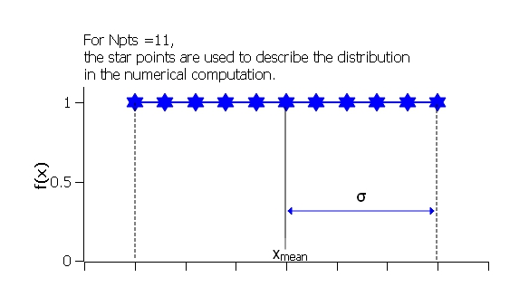
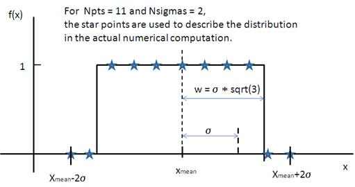
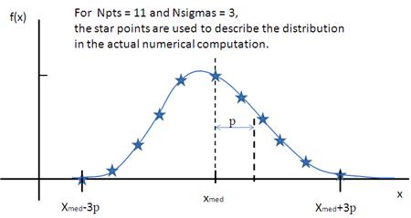

.. pd_help.rst

.. This is a port of the original SasView html help file to ReSTructured text
.. by S King, ISIS, during SasView CodeCamp-III in Feb 2015.

.. ZZZZZZZZZZZZZZZZZZZZZZZZZZZZZZZZZZZZZZZZZZZZZZZZZZZZZZZZZZZZZZZZZZZZZZZZZZZZZ

.. _polydispersityhelp:

Polydispersity & Orientational Distributions
--------------------------------------------

For some models we can calculate the average intensity for a population of 
particles that possess size and/or orientational (ie, angular) distributions. 
In SasView we call the former *polydispersity* but use the parameter *PD* to 
parameterise both. In other words, the meaning of *PD* in a model depends on 
the actual parameter it is being applied too.

The resultant intensity is then normalized by the average particle volume such 
that

.. math::

  P(q) = \text{scale} \langle F^* F \rangle / V + \text{background}

where $F$ is the scattering amplitude and $\langle\cdot\rangle$ denotes an 
average over the distribution $f(x; \bar x, \sigma)$, giving

.. math::

  P(q) = \frac{\text{scale}}{V} \int_\mathbb{R} 
  f(x; \bar x, \sigma) F^2(q, x)\, dx + \text{background}

Each distribution is characterized by a center value $\bar x$ or
$x_\text{med}$, a width parameter $\sigma$ (note this is *not necessarily*
the standard deviation, so read the description of the distribution carefully), 
the number of sigmas $N_\sigma$ to include from the tails of the distribution, 
and the number of points used to compute the average. The center of the 
distribution is set by the value of the model parameter.

The distribution width applied to *volume* (ie, shape-describing) parameters 
is relative to the center value such that $\sigma = \mathrm{PD} \cdot \bar x$. 
However, the distribution width applied to *orientation* parameters is just 
$\sigma = \mathrm{PD}$.

$N_\sigma$ determines how far into the tails to evaluate the distribution,
with larger values of $N_\sigma$ required for heavier tailed distributions.
The scattering in general falls rapidly with $qr$ so the usual assumption
that $f(r - 3\sigma_r)$ is tiny and therefore $f(r - 3\sigma_r)f(r - 3\sigma_r)$
will not contribute much to the average may not hold when particles are large.
This, too, will require increasing $N_\sigma$.

Users should note that the averaging computation is very intensive. Applying
polydispersion and/or orientational distributions to multiple parameters at 
the same time, or increasing the number of points in the distribution, will 
require patience! However, the calculations are generally more robust with 
more data points or more angles.

The following distribution functions are provided:

*  *Uniform Distribution*
*  *Rectangular Distribution*
*  *Gaussian Distribution*
*  *Boltzmann Distribution*
*  *Lognormal Distribution*
*  *Schulz Distribution*
*  *Array Distribution*

These are all implemented as *number-average* distributions.

Additional distributions are under consideration.

**Beware: when the Polydispersity & Orientational Distribution panel in SasView is**
**first opened, the default distribution for all parameters is the Gaussian Distribution.**
**This may not be suitable. See Suggested Applications below.**

.. note:: In 2009 IUPAC decided to introduce the new term 'dispersity' to replace 
           the term 'polydispersity' (see `Pure Appl. Chem., (2009), 81(2), 
           351-353 <http://media.iupac.org/publications/pac/2009/pdf/8102x0351.pdf>`_ 
           in order to make the terminology describing distributions of chemical 
           properties unambiguous. However, these terms are unrelated to the 
           proportional size distributions and orientational distributions used in 
           SasView models.

Suggested Applications
^^^^^^^^^^^^^^^^^^^^^^

If applying polydispersion to parameters describing particle sizes, consider using
the Lognormal or Schulz distributions.

If applying polydispersion to parameters describing interfacial thicknesses
or angular orientations, consider using the Gaussian or Boltzmann distributions.

If applying polydispersion to parameters describing angles, use the Uniform 
distribution. Beware of using distributions that are always positive (eg, the 
Lognormal) because angles can be negative!

The array distribution allows a user-defined distribution to be applied.

.. ZZZZZZZZZZZZZZZZZZZZZZZZZZZZZZZZZZZZZZZZZZZZZZZZZZZZZZZZZZZZZZZZZZZZZZZZZZZZZ

Uniform Distribution
^^^^^^^^^^^^^^^^^^^^

The Uniform Distribution is defined as

.. math::

    f(x) = \frac{1}{\text{Norm}}
    \begin{cases}
        1 & \text{for } |x - \bar x| \leq \sigma \\
        0 & \text{for } |x - \bar x| > \sigma
    \end{cases}

where $\bar x$ ($x_\text{mean}$ in the figure) is the mean of the
distribution, $\sigma$ is the half-width, and *Norm* is a normalization
factor which is determined during the numerical calculation.

The polydispersity in sasmodels is given by

.. math:: \text{PD} = \sigma / \bar x

    Uniform distribution.

The value $N_\sigma$ is ignored for this distribution.

.. ZZZZZZZZZZZZZZZZZZZZZZZZZZZZZZZZZZZZZZZZZZZZZZZZZZZZZZZZZZZZZZZZZZZZZZZZZZZZZ

Rectangular Distribution
^^^^^^^^^^^^^^^^^^^^^^^^

The Rectangular Distribution is defined as

.. math::

    f(x) = \frac{1}{\text{Norm}}
    \begin{cases}
        1 & \text{for } |x - \bar x| \leq w \\
        0 & \text{for } |x - \bar x| > w
    \end{cases}

where $\bar x$ ($x_\text{mean}$ in the figure) is the mean of the
distribution, $w$ is the half-width, and *Norm* is a normalization
factor which is determined during the numerical calculation.

Note that the standard deviation and the half width $w$ are different!

The standard deviation is

.. math:: \sigma = w / \sqrt{3}

whilst the polydispersity in sasmodels is given by

.. math:: \text{PD} = \sigma / \bar x

    Rectangular distribution.

.. note:: The Rectangular Distribution is deprecated in favour of the
            Uniform Distribution above and is described here for backwards
            compatibility with earlier versions of SasView only.

.. ZZZZZZZZZZZZZZZZZZZZZZZZZZZZZZZZZZZZZZZZZZZZZZZZZZZZZZZZZZZZZZZZZZZZZZZZZZZZZ

Gaussian Distribution
^^^^^^^^^^^^^^^^^^^^^

The Gaussian Distribution is defined as

.. math::

    f(x) = \frac{1}{\text{Norm}}
            \exp\left(-\frac{(x - \bar x)^2}{2\sigma^2}\right)

where $\bar x$ ($x_\text{mean}$ in the figure) is the mean of the
distribution and *Norm* is a normalization factor which is determined
during the numerical calculation.

The polydispersity in sasmodels is given by

.. math:: \text{PD} = \sigma / \bar x

.. figure:: pd_gaussian.jpg

    Normal distribution.

.. ZZZZZZZZZZZZZZZZZZZZZZZZZZZZZZZZZZZZZZZZZZZZZZZZZZZZZZZZZZZZZZZZZZZZZZZZZZZZZ

Boltzmann Distribution
^^^^^^^^^^^^^^^^^^^^^^

The Boltzmann Distribution is defined as

.. math::

    f(x) = \frac{1}{\text{Norm}}
            \exp\left(-\frac{ | x - \bar x | }{\sigma}\right)

where $\bar x$ ($x_\text{mean}$ in the figure) is the mean of the
distribution and *Norm* is a normalization factor which is determined
during the numerical calculation.

The width is defined as

.. math:: \sigma=\frac{k T}{E}

which is the inverse Boltzmann factor, where $k$ is the Boltzmann constant,
$T$ the temperature in Kelvin and $E$ a characteristic energy per particle.

.. figure:: pd_boltzmann.jpg

    Boltzmann distribution.

.. ZZZZZZZZZZZZZZZZZZZZZZZZZZZZZZZZZZZZZZZZZZZZZZZZZZZZZZZZZZZZZZZZZZZZZZZZZZZZZ

Lognormal Distribution
^^^^^^^^^^^^^^^^^^^^^^

The Lognormal Distribution describes a function of $x$ where $\ln (x)$ has
a normal distribution. The result is a distribution that is skewed towards
larger values of $x$.

The Lognormal Distribution is defined as

.. math::

    f(x) = \frac{1}{\text{Norm}}\frac{1}{x\sigma}
            \exp\left(-\frac{1}{2}
                        \bigg(\frac{\ln(x) - \mu}{\sigma}\bigg)^2\right)

where *Norm* is a normalization factor which will be determined during
the numerical calculation, $\mu=\ln(x_\text{med})$ and $x_\text{med}$
is the *median* value of the *lognormal* distribution, but $\sigma$ is
a parameter describing the width of the underlying *normal* distribution.

$x_\text{med}$ will be the value given for the respective size parameter
in sasmodels, for example, *radius=60*.

The polydispersity in sasmodels is given by

.. math:: \text{PD} = \sigma = p / x_\text{med}

The mean value of the distribution is given by $\bar x = \exp(\mu+ \sigma^2/2)$
and the peak value by $\max x = \exp(\mu - \sigma^2)$.

The variance (the square of the standard deviation) of the *lognormal*
distribution is given by

.. math::

    \nu = [\exp({\sigma}^2) - 1] \exp({2\mu + \sigma^2})

Note that larger values of PD might need a larger number of points
and $N_\sigma$.

    Lognormal distribution for PD=0.1.

For further information on the Lognormal distribution see:
http://en.wikipedia.org/wiki/Log-normal_distribution and
http://mathworld.wolfram.com/LogNormalDistribution.html

.. ZZZZZZZZZZZZZZZZZZZZZZZZZZZZZZZZZZZZZZZZZZZZZZZZZZZZZZZZZZZZZZZZZZZZZZZZZZZZZ

Schulz Distribution
^^^^^^^^^^^^^^^^^^^

The Schulz (sometimes written Schultz) distribution is similar to the
Lognormal distribution, in that it is also skewed towards larger values of
$x$, but which has computational advantages over the Lognormal distribution.

The Schulz distribution is defined as

.. math::

    f(x) = \frac{1}{\text{Norm}} (z+1)^{z+1}(x/\bar x)^z
            \frac{\exp[-(z+1)x/\bar x]}{\bar x\Gamma(z+1)}

where $\bar x$ ($x_\text{mean}$ in the figure) is the mean of the
distribution, *Norm* is a normalization factor which is determined
during the numerical calculation, and $z$ is a measure of the width
of the distribution such that

.. math:: z = (1-p^2) / p^2

where $p$ is the polydispersity in sasmodels given by

.. math:: PD = p = \sigma / \bar x

and $\sigma$ is the RMS deviation from $\bar x$.

Note that larger values of PD might need a larger number of points
and $N_\sigma$. For example, for PD=0.7 with radius=60 |Ang|, at least
Npts>=160 and Nsigmas>=15 are required.

.. figure:: pd_schulz.jpg

    Schulz distribution.

For further information on the Schulz distribution see:
M Kotlarchyk & S-H Chen, *J Chem Phys*, (1983), 79, 2461 and
M Kotlarchyk, RB Stephens, and JS Huang, *J Phys Chem*, (1988), 92, 1533

.. ZZZZZZZZZZZZZZZZZZZZZZZZZZZZZZZZZZZZZZZZZZZZZZZZZZZZZZZZZZZZZZZZZZZZZZZZZZZZZ

Array Distribution
^^^^^^^^^^^^^^^^^^

This user-definable distribution should be given as a simple ASCII text
file where the array is defined by two columns of numbers: $x$ and $f(x)$.
The $f(x)$ will be normalized to 1 during the computation.

Example of what an array distribution file should look like:

====  =====
 30    0.1
 32    0.3
 35    0.4
 36    0.5
 37    0.6
 39    0.7
 41    0.9
====  =====

Only these array values are used computation, therefore the parameter value
given for the model will have no affect, and will be ignored when computing
the average.  This means that any parameter with an array distribution will
not be fitable.

.. ZZZZZZZZZZZZZZZZZZZZZZZZZZZZZZZZZZZZZZZZZZZZZZZZZZZZZZZZZZZZZZZZZZZZZZZZZZZZZ

Note about DLS polydispersity
^^^^^^^^^^^^^^^^^^^^^^^^^^^^^

Several measures of polydispersity abound in Dynamic Light Scattering (DLS) and 
it should not be assumed that any of the following can be simply equated with 
the polydispersity *PD* parameter used in SasView.

The dimensionless **Polydispersity Index (PI)** is a measure of the width of the 
distribution of autocorrelation function decay rates (*not* the distribution of 
particle sizes itself, though the two are inversely related) and is defined by 
ISO 22412:2017 as

.. math::

    PI = \mu_{2} / \bar \Gamma^2

where $\mu_\text{2}$ is the second cumulant, and $\bar \Gamma^2$ is the 
intensity-weighted average value, of the distribution of decay rates.

*If the distribution of decay rates is Gaussian* then

.. math::

    PI = \sigma^2 / 2\bar \Gamma^2

where $\sigma$ is the standard deviation, allowing a **Relative Polydispersity (RP)** 
to be defined as

.. math::

    RP = \sigma / \bar \Gamma = \sqrt{2 \cdot PI}

PI values smaller than 0.05 indicate a highly monodisperse system. Values 
greater than 0.7 indicate significant polydispersity.

The **size polydispersity P-parameter** is defined as the relative standard 
deviation coefficient of variation  

.. math::

    P = \sqrt\nu / \bar R

where $\nu$ is the variance of the distribution and $\bar R$ is the mean
value of $R$. Here, the product $P \bar R$ is *equal* to the standard 
deviation of the Lognormal distribution.

P values smaller than 0.13 indicate a monodisperse system.

For more information see:

`ISO 22412:2017, International Standards Organisation (2017) <https://www.iso.org/standard/65410.html>`_.

`Polydispersity: What does it mean for DLS and Chromatography <http://www.materials-talks.com/blog/2014/10/23/polydispersity-what-does-it-mean-for-dls-and-chromatography/>`_.

`Dynamic Light Scattering: Common Terms Defined, Whitepaper WP111214. Malvern Instruments (2011) <http://www.biophysics.bioc.cam.ac.uk/wp-content/uploads/2011/02/DLS_Terms_defined_Malvern.pdf>`_.

S King, C Washington & R Heenan, *Phys Chem Chem Phys*, (2005), 7, 143.

T Allen, in *Particle Size Measurement*, 4th Edition, Chapman & Hall, London (1990).

.. ZZZZZZZZZZZZZZZZZZZZZZZZZZZZZZZZZZZZZZZZZZZZZZZZZZZZZZZZZZZZZZZZZZZZZZZZZZZZZ

*Document History*

| 2015-05-01 Steve King
| 2017-05-08 Paul Kienzle
| 2018-03-20 Steve King
| 2018-04-04 Steve King
| 2018-08-09 Steve King
