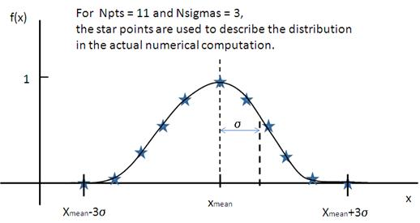

.. pd_help.rst

.. This is a port of the original SasView html help file to ReSTructured text
.. by S King, ISIS, during SasView CodeCamp-III in Feb 2015.

.. ZZZZZZZZZZZZZZZZZZZZZZZZZZZZZZZZZZZZZZZZZZZZZZZZZZZZZZZZZZZZZZZZZZZZZZZZZZZZZ

.. _polydispersityhelp:

Polydispersity Distributions
----------------------------

With some models in sasmodels we can calculate the average intensity for a
population of particles that exhibit size and/or orientational
polydispersity. The resultant intensity is normalized by the average
particle volume such that

.. math::

  P(q) = \text{scale} \langle F^* F \rangle / V + \text{background}

where $F$ is the scattering amplitude and $\langle\cdot\rangle$ denotes an
average over the size distribution.

Each distribution is characterized by its center $\bar x$, its width $\sigma$,
the number of sigmas $N_\sigma$ to include from the tails, and the number of
points used to compute the average. The center of the distribution is set by the
value of the model parameter.  Volume parameters have polydispersity *PD*
(not to be confused with a molecular weight distributions in polymer science)
leading to a size distribution of width $\text{PD} = \sigma / \bar x$, but
orientation parameters use an angular distributions of width $\sigma$.
$N_\sigma$ determines how far into the tails to evaluate the distribution, with
larger values of $N_\sigma$ required for heavier tailed distributions.
The scattering in general falls rapidly with $qr$ so the usual assumption
that $G(r - 3\sigma_r)$ is tiny and therefore $f(r - 3\sigma_r)G(r - 3\sigma_r)$
will not contribute much to the average may not hold when particles are large.
This, too, will require increasing $N_\sigma$.

Users should note that the averaging computation is very intensive. Applying
polydispersion to multiple parameters at the same time or increasing the
number of points in the distribution will require patience! However, the
calculations are generally more robust with more data points or more angles.

The following distribution functions are provided:

*  *Rectangular Distribution*
*  *Uniform Distribution*
*  *Gaussian Distribution*
*  *Lognormal Distribution*
*  *Schulz Distribution*
*  *Array Distribution*
*  *Boltzmann Distribution*

These are all implemented as *number-average* distributions.

.. ZZZZZZZZZZZZZZZZZZZZZZZZZZZZZZZZZZZZZZZZZZZZZZZZZZZZZZZZZZZZZZZZZZZZZZZZZZZZZ

Rectangular Distribution
^^^^^^^^^^^^^^^^^^^^^^^^

The Rectangular Distribution is defined as

.. math::

    f(x) = \frac{1}{\text{Norm}}
    \begin{cases}
      1 & \text{for } |x - \bar x| \leq w \\
      0 & \text{for } |x - \bar x| > w
    \end{cases}

where $\bar x$ is the mean of the distribution, $w$ is the half-width, and
*Norm* is a normalization factor which is determined during the numerical
calculation.

Note that the standard deviation and the half width $w$ are different!

The standard deviation is

.. math:: \sigma = w / \sqrt{3}

whilst the polydispersity is

.. math:: \text{PD} = \sigma / \bar x

.. figure:: pd_rectangular.jpg

    Rectangular distribution.

Uniform Distribution
^^^^^^^^^^^^^^^^^^^^^^^^

The Uniform Distribution is defined as

    .. math::

        f(x) = \frac{1}{\text{Norm}}
        \begin{cases}
          1 & \text{for } |x - \bar x| \leq \sigma \\
          0 & \text{for } |x - \bar x| > \sigma
        \end{cases}

    where $\bar x$ is the mean of the distribution, $\sigma$ is the half-width, and
    *Norm* is a normalization factor which is determined during the numerical
    calculation.

    Note that the polydispersity is given by

    .. math:: \text{PD} = \sigma / \bar x

    .. figure:: pd_uniform.jpg

        Uniform distribution.

.. ZZZZZZZZZZZZZZZZZZZZZZZZZZZZZZZZZZZZZZZZZZZZZZZZZZZZZZZZZZZZZZZZZZZZZZZZZZZZZ

Gaussian Distribution
^^^^^^^^^^^^^^^^^^^^^

The Gaussian Distribution is defined as

.. math::

    f(x) = \frac{1}{\text{Norm}}
           \exp\left(-\frac{(x - \bar x)^2}{2\sigma^2}\right)

where $\bar x$ is the mean of the distribution and *Norm* is a normalization
factor which is determined during the numerical calculation.

The polydispersity is

.. math:: \text{PD} = \sigma / \bar x

    Normal distribution.

.. ZZZZZZZZZZZZZZZZZZZZZZZZZZZZZZZZZZZZZZZZZZZZZZZZZZZZZZZZZZZZZZZZZZZZZZZZZZZZZ

Lognormal Distribution
^^^^^^^^^^^^^^^^^^^^^^

The Lognormal Distribution is defined as

.. math::

    f(x) = \frac{1}{\text{Norm}}
           \frac{1}{xp}\exp\left(-\frac{(\ln(x) - \mu)^2}{2p^2}\right)

where $\mu=\ln(x_\text{med})$ when $x_\text{med}$ is the median value of the
distribution, and *Norm* is a normalization factor which will be determined
during the numerical calculation.

The median value for the distribution will be the value given for the
respective size parameter, for example, *radius=60*.

The polydispersity is given by $\sigma$

.. math:: \text{PD} = p

For the angular distribution

.. math:: p = \sigma / x_\text{med}

The mean value is given by $\bar x = \exp(\mu+ p^2/2)$. The peak value
is given by $\max x = \exp(\mu - p^2)$.

.. figure:: pd_lognormal.jpg

    Lognormal distribution.

This distribution function spreads more, and the peak shifts to the left, as
$p$ increases, so it requires higher values of $N_\sigma$ and more points
in the distribution.

.. ZZZZZZZZZZZZZZZZZZZZZZZZZZZZZZZZZZZZZZZZZZZZZZZZZZZZZZZZZZZZZZZZZZZZZZZZZZZZZ

Schulz Distribution
^^^^^^^^^^^^^^^^^^^

The Schulz distribution is defined as

.. math::

    f(x) = \frac{1}{\text{Norm}}
           (z+1)^{z+1}(x/\bar x)^z\frac{\exp[-(z+1)x/\bar x]}{\bar x\Gamma(z+1)}

where $\bar x$ is the mean of the distribution and *Norm* is a normalization
factor which is determined during the numerical calculation, and $z$ is a
measure of the width of the distribution such that

.. math:: z = (1-p^2) / p^2

The polydispersity is

.. math:: p = \sigma / \bar x

Note that larger values of PD might need larger number of points and $N_\sigma$.
For example, at PD=0.7 and radius=60 |Ang|, Npts>=160 and Nsigmas>=15 at least.

.. figure:: pd_schulz.jpg

    Schulz distribution.

For further information on the Schulz distribution see:
M Kotlarchyk & S-H Chen, *J Chem Phys*, (1983), 79, 2461.

.. ZZZZZZZZZZZZZZZZZZZZZZZZZZZZZZZZZZZZZZZZZZZZZZZZZZZZZZZZZZZZZZZZZZZZZZZZZZZZZ

Array Distribution
^^^^^^^^^^^^^^^^^^

This user-definable distribution should be given as a simple ASCII text
file where the array is defined by two columns of numbers: $x$ and $f(x)$.
The $f(x)$ will be normalized to 1 during the computation.

Example of what an array distribution file should look like:

====  =====
 30    0.1
 32    0.3
 35    0.4
 36    0.5
 37    0.6
 39    0.7
 41    0.9
====  =====

Only these array values are used computation, therefore the parameter value
given for the model will have no affect, and will be ignored when computing
the average.  This means that any parameter with an array distribution will
not be fitable.

.. ZZZZZZZZZZZZZZZZZZZZZZZZZZZZZZZZZZZZZZZZZZZZZZZZZZZZZZZZZZZZZZZZZZZZZZZZZZZZZ

Boltzmann Distribution
^^^^^^^^^^^^^^^^^^^^^^

The Boltzmann Distribution is defined as

.. math::

    f(x) = \frac{1}{\text{Norm}}
           \exp\left(-\frac{ | x - \bar x | }{\sigma}\right)

where $\bar x$ is the mean of the distribution and *Norm* is a normalization
factor which is determined during the numerical calculation.
The width is defined as

.. math:: \sigma=\frac{k T}{E}

which is the inverse Boltzmann factor,
where $k$ is the Boltzmann constant, $T$ the temperature in Kelvin and $E$ a
characteristic energy per particle.

.. figure:: pd_boltzmann.jpg

    Boltzmann distribution.

.. ZZZZZZZZZZZZZZZZZZZZZZZZZZZZZZZZZZZZZZZZZZZZZZZZZZZZZZZZZZZZZZZZZZZZZZZZZZZZZ

Note about DLS polydispersity
^^^^^^^^^^^^^^^^^^^^^^^^^^^^^

Many commercial Dynamic Light Scattering (DLS) instruments produce a size
polydispersity parameter, sometimes even given the symbol $p$\ ! This
parameter is defined as the relative standard deviation coefficient of
variation of the size distribution and is NOT the same as the polydispersity
parameters in the Lognormal and Schulz distributions above (though they all
related) except when the DLS polydispersity parameter is <0.13.

For more information see:
S King, C Washington & R Heenan, *Phys Chem Chem Phys*, (2005), 7, 143

.. ZZZZZZZZZZZZZZZZZZZZZZZZZZZZZZZZZZZZZZZZZZZZZZZZZZZZZZZZZZZZZZZZZZZZZZZZZZZZZ

*Document History*

| 2015-05-01 Steve King
| 2017-05-08 Paul Kienzle
