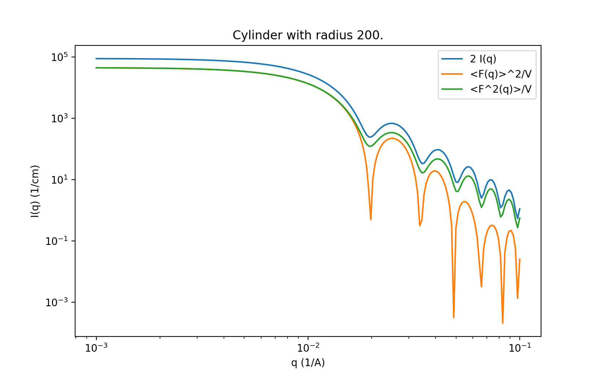

.. py:currentmodule:: sasmodels

.. _Scripting_Interface:

*******************
Scripting Interface
*******************

Preparing your environment
==========================

You can use python scripts to load and plot your data, create SAS models and fit parameters. You can save a script to a file such as `example/model.py` and run
it later. However, this requires a scripting environment with the correct packages installed.

You can *either* use the SasView application itself (versions after 5.0.5), as
both bumps and sasmodels are included as part of the distribution, so for
example on Windows::

    > sasview model.py
 
(Note that it may be necessary to first add the folder path to sasmodels/sasview
to your *Path* environment variable for this to work; set PATH=%PATH%;C:\\your\\path\\here\\ . The folder path can be found in the
Help > About box if you are running the SasView GUI.)

*or* create a Python environment with pip::

    > pip install sasmodels sasdata matplotlib bumps periodictable
    > python model.py

(You can also create a Python environment using conda, see:
https://github.com/SasView/sasview/wiki/DevNotes_CondaDevEnviroment)

The pip command also works within a `Jupyter notebook <https://docs.jupyter.org/en/latest/install.html>`_ ::

    %pip install sasmodels sasdata matplotlib bumps periodictable

On a Mac the command for invoking SasView will be something like::

    /Applications/Sasview5.dmg/Contents/MacOS/sasview

depending on where it is actually installed. This can either be used directly
or can be symlinked into your path, for example::

    mkdir ~/bin
    ln -s /path/to/Applications/SasView5.dmg/Contents/MacOS/sasview ~/bin

Preparing your data
===================

The key functions are then :func:`.core.load_model` for loading the
model definition and compiling the kernel and
:func:`.data.load_data` for calling sasview to load the data.

Usually you will load data via the sasview loader, with the
:func:`.data.load_data` function.  For example::

    from sasmodels.data import load_data
    data = load_data("sasmodels/example/093191_201.dat")

You may want to apply a data mask, such a beam stop, and trim high $q$::

    from sasmodels.data import set_beam_stop
    set_beam_stop(data, qmin, qmax)

The :func:`.data.set_beam_stop` method simply sets the *mask*
attribute for the data.

The data defines the resolution function and the q values to evaluate, so
even if you simulating experiments prior to making measurements, you still
need a data object for reference. Use :func:`.data.empty_data1D`
or :func:`.data.empty_data2D` to create a container with a
given $q$ and $\Delta q/q$.  For example::

    import numpy as np
    from sasmodels.data import empty_data1D

    # 120 points logarithmically spaced from 0.005 to 0.2, with dq/q = 5%
    q = np.logspace(np.log10(5e-3), np.log10(2e-1), 120)
    data = empty_data1D(q, resolution=0.05)

To use a more realistic model of resolution, or to load data from a file
format not understood by SasView, you can use :class:`.data.Data1D`
or :class:`.data.Data2D` directly.  The 1D data uses
*x*, *y*, *dx* and *dy* for $x = q$ and $y = I(q)$, and 2D data uses
*x*, *y*, *z*, *dx*, *dy*, *dz* for $x, y = qx, qy$ and $z = I(qx, qy)$.
[Note: internally, the Data2D object uses SasView conventions,
*qx_data*, *qy_data*, *data*, *dqx_data*, *dqy_data*, and *err_data*.]

For USANS data, use 1D data, but set *dxl* and *dxw* attributes to
indicate slit resolution::

    data.dxl = 0.117

See :func:`.resolution.slit_resolution` for details.

SESANS data is more complicated; if your SESANS format is not supported by
SasView you need to define a number of attributes beyond *x*, *y*.  For
example::

    SElength = np.linspace(0, 2400, 61) # [A]
    data = np.ones_like(SElength)
    err_data = np.ones_like(SElength)*0.03

    class Source:
        wavelength = 6 # [A]
        wavelength_unit = "A"
    class Sample:
        zacceptance = 0.1 # [A^-1]
        thickness = 0.2 # [cm]

    class SESANSData1D:
        #q_zmax = 0.23 # [A^-1]
        lam = 0.2 # [nm]
        x = SElength
        y = data
        dy = err_data
        sample = Sample()
    data = SESANSData1D()

    x, y = ... # create or load sesans
    data = smd.Data

The *data* module defines various data plotters as well.

Using sasmodels directly
========================

Once you have a computational kernel and a data object, you can evaluate
the model for various parameters using
:class:`.direct_model.DirectModel`.  The resulting object *f*
will be callable as *f(par=value, ...)*, returning the $I(q)$ for the $q$
values in the data.  For example::

    import numpy as np
    from sasmodels.data import empty_data1D
    from sasmodels.core import load_model
    from sasmodels.direct_model import DirectModel

    # 120 points logarithmically spaced from 0.005 to 0.2, with dq/q = 5%
    q = np.logspace(np.log10(5e-3), np.log10(2e-1), 120)
    data = empty_data1D(q, resolution=0.05)
    kernel = load_model("ellipsoid)
    f = DirectModel(data, kernel)
    Iq = f(radius_polar=100)

Polydispersity information is set with special parameter names:

    * *par_pd* for polydispersity width, $\Delta p/p$,
    * *par_pd_n* for the number of points in the distribution,
    * *par_pd_type* for the distribution type (as a string), and
    * *par_pd_nsigmas* for the limits of the distribution.

Using sasmodels through the bumps optimizer
===========================================

Like DirectModel, you can wrap data and a kernel in a *bumps* model with
:class:`.bumps_model.Model` and create a
:class:`.bumps_model.Experiment` that you can fit with the *bumps*
interface. Here is an example from the *example* directory such as
*example/model.py*::

    import sys
    from bumps.names import *
    from sasmodels.core import load_model
    from sasmodels.bumps_model import Model, Experiment
    from sasmodels.data import load_data, set_beam_stop, set_top

    """ IMPORT THE DATA USED """
    radial_data = load_data('DEC07267.DAT')
    set_beam_stop(radial_data, 0.00669, outer=0.025)
    set_top(radial_data, -.0185)

    kernel = load_model("ellipsoid")

    model = Model(kernel,
        scale=0.08,
        radius_polar=15, radius_equatorial=800,
        sld=.291, sld_solvent=7.105,
        background=0,
        theta=90, phi=0,
        theta_pd=15, theta_pd_n=40, theta_pd_nsigma=3,
        radius_polar_pd=0.222296, radius_polar_pd_n=1, radius_polar_pd_nsigma=0,
        radius_equatorial_pd=.000128, radius_equatorial_pd_n=1, radius_equatorial_pd_nsigma=0,
        phi_pd=0, phi_pd_n=20, phi_pd_nsigma=3,
        )

    # SET THE FITTING PARAMETERS
    model.radius_polar.range(15, 1000)
    model.radius_equatorial.range(15, 1000)
    model.theta_pd.range(0, 360)
    model.background.range(0,1000)
    model.scale.range(0, 10)

    #cutoff = 0     # no cutoff on polydisperisity loops
    #cutoff = 1e-5  # default cutoff
    cutoff = 1e-3  # low precision cutoff
    M = Experiment(data=radial_data, model=model, cutoff=cutoff)
    problem = FitProblem(M)

To run the model from your python environment use the installed *bumps* program::

    > bumps example/model.py --preview

Alternatively, on Windows, bumps can be called from the cmd prompt
as follows::

    > sasview -m bumps.cli example/model.py --preview

Calling the computation kernel
==============================

Getting a simple function that you can call on a set of q values and return
a result is not so simple.  Since the time critical use case (fitting) involves
calling the function over and over with identical $q$ values, we chose to
optimize the call by only transfering the $q$ values to the GPU once at the
start of the fit.  We do this by creating a :class:`.kernel.Kernel`
object from the :class:`.kernel.KernelModel` returned from
:func:`.core.load_model` using the
:meth:`.kernel.KernelModel.make_kernel` method.  What it actual
does depends on whether it is running as a DLL, as OpenCL or as a pure
python kernel.  Once the kernel is in hand, we can then marshal a set of
parameters into a :class:`.details.CallDetails` object and ship it to
the kernel using the :func:`.direct_model.call_kernel` function.  To
accesses the underlying $<F(q)>$ and $<F^2(q)>$, use
:func:`.direct_model.call_Fq` instead.

The following example should
help, *example/cylinder_eval.py*::

    from numpy import logspace, sqrt
    from matplotlib import pyplot as plt
    from sasmodels.core import load_model
    from sasmodels.direct_model import call_kernel, call_Fq

    model = load_model('cylinder')
    q = logspace(-3, -1, 200)
    kernel = model.make_kernel([q])
    pars = {'radius': 200, 'radius_pd': 0.1, 'scale': 2}
    Iq = call_kernel(kernel, pars)
    F, Fsq, Reff, V, Vratio = call_Fq(kernel, pars)

    plt.loglog(q, Iq, label='2 I(q)')
    plt.loglog(q, F**2/V, label='<F(q)>^2/V')
    plt.loglog(q, Fsq/V, label='<F^2(q)>/V')
    plt.xlabel('q (1/A)')
    plt.ylabel('I(q) (1/cm)')
    plt.title('Cylinder with radius 200.')
    plt.legend()
    plt.show()

    Comparison between $I(q)$, $<F(q)>$ and $<F^2(q)>$ for cylinder model.

This compares $I(q)$ with $<F(q)>$ and $<F^2(q)>$ for a cylinder
with *radius=200 +/- 20* and *scale=2*. Note that *call_Fq* does not
include scale and background, nor does it normalize by the average volume.
The definition of $F = \rho V \hat F$ scaled by the contrast and
volume, compared to the canonical cylinder $\hat F$, with $\hat F(0) = 1$.
Integrating over polydispersity and orientation, the returned values are
$\sum_{r,w\in N(r_o, r_o/10)} \sum_\theta w F(q,r_o,\theta)\sin\theta$ and
$\sum_{r,w\in N(r_o, r_o/10)} \sum_\theta w F^2(q,r_o,\theta)\sin\theta$.

On Windows, this example can be called from the cmd prompt using sasview as
as the python interpreter::

    > sasview example/cylinder_eval.py

Using sasmodels and bumps from a Jupyter notebook
=================================================

You can also use sasmodels/bumps to fit experimental data from a 
`Jupyter notebook <https://docs.jupyter.org/en/latest/install.html>`_ by
constructing and computing the model in an analogous manner to that shown above.
For an example notebook see:

https://github.com/SasView/documents/blob/master/Notebooks/sasmodels_fitting.ipynb
