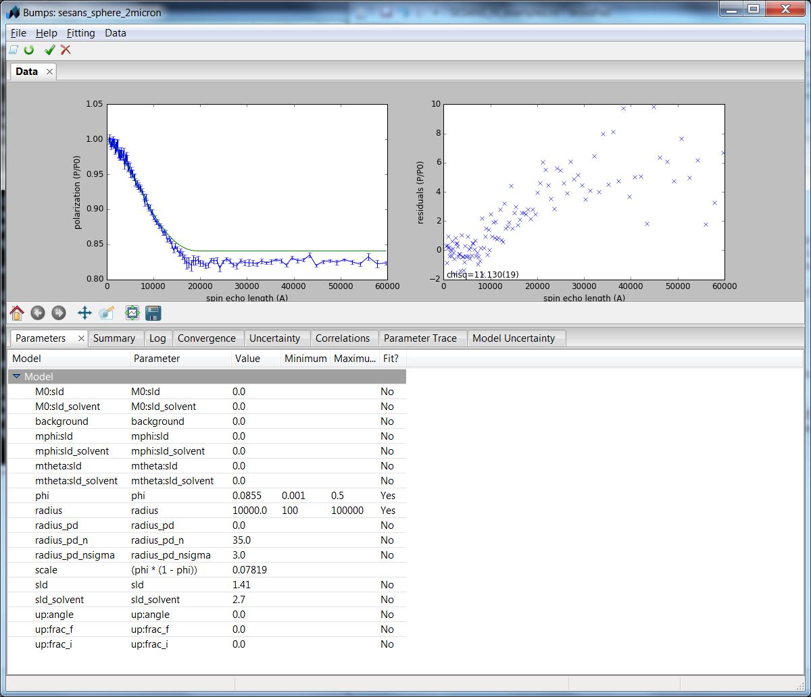
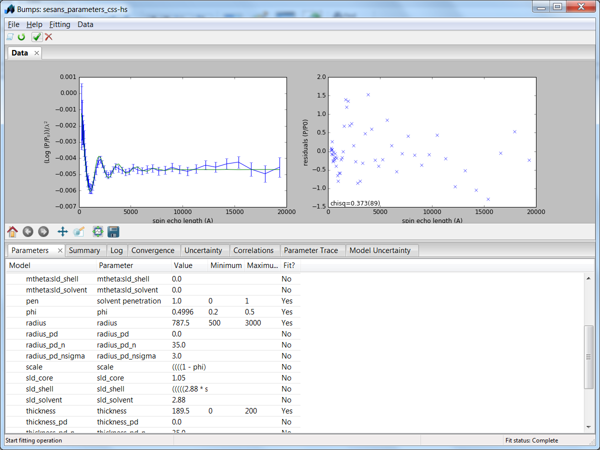

.. currentmodule:: sasmodels
.. Wim Bouwman, DUT, written at codecamp-V, Oct2016

.. _sesans_fitting:

Fitting SESANS Data
===================

.. note::

    A proper installation of the developers setup of SasView
    (http://trac.sasview.org/wiki/AnacondaSetup) is a prerequisite for
    using these instructions.

It is possible to fit SESANS measurements from the command line in Python.

Simple Fits
...........
In the folder sasmodels/example the file sesans_sphere_2micron.py gives
an example of how to fit a shape to a measurement.

The command::

  >python fit_sesans.py sesans_sphere_2micron.py

then results in a GUI from which you can control the fit.

All the parameters and names in sesans_sphere_2micron.py (shown below) can
be adjusted to fit your own problem::

  """
  This is a data file  used to load in sesans data and fit it using the bumps engine
  """
  from bumps.names import *

  import sesansfit

  # Enter the model name to use
  model_name = "sphere"

  # DO NOT MODIFY THIS LINE
  model = sesansfit.get_bumps_model(model_name)

  # Enter any custom parameters
  # name = Parameter(initial_value, name='name')
  phi = Parameter(0.0855, name='phi')
  # Add the parameters to this list that should be displayed in the fitting window
  custom_params = {"phi" : phi}

  # SESANS data file name
  sesans_file = "spheres2micron.ses"

  # Initial parameter values (if other than defaults)
  # "model_parameter_name" : value
  initial_vals = {
    "sld" : 1.41,
    "radius" : 10000,
    "sld_solvent" : 2.70,
  }

  # Ranges for parameters if other than default
  # "model_parameter_name" : [min, max]
  param_range = {
    "phi" : [0.001, 0.5],
    "radius" : [100, 100000]
  }

  # Constraints
  # model.param_name = f(other params)
  # EXAMPLE: model.scale = model.radius*model.radius*(1 - phi) - where radius
  # and scale are model functions and phi is a custom parameter
  model.scale = phi*(1-phi)

  # Send to the fitting engine
  # DO NOT MODIFY THIS LINE
  problem = sesansfit.sesans_fit(sesans_file, model, initial_vals, custom_params, param_range)

Incorporating a Structure Factor
................................
An example of how to also include a structure factor can be seen in the
following example taken from Washington et al., *Soft Matter*\, (2014), 10, 3016
(dx.doi.org/10.1039/C3SM53027B). These are time-of-flight measurements, which
is the reason that not the polarisation is plotted, but the
:math:`\frac{log(P/P_0)}{\lambda^2}` . The sample is a dispersion of
core-shell colloids at a high volume fraction with hard sphere interactions.

The fit can be started by::

 >python fit_sesans.py sesans_parameters_css-hs.py

This yields after the fitting:

The code sesans_parameters_css-hs.py can then be used as a template for a
fitting problem with a structure factor::

 """
 This is a data file  used to load in sesans data and fit it using the bumps engine
 """
 from bumps.names import *

 import sesansfit

 # Enter the model name to use
 model_name = "core_shell_sphere*hardsphere"

 # DO NOT MODIFY THIS LINE
 model = sesansfit.get_bumps_model(model_name)

 # Enter any custom parameters
 phi = Parameter(0.45, name='phi')
 pen = Parameter(0.95, name='solvent penetration')
 custom_params = {"phi" : phi, "pen" : pen}

 # SESANS data file
 sesans_file = "core_shell.ses"

 # Initial parameter values (if other than defaults)
 initial_vals = {
    "sld_core" : 1.05,
    "sld_shell" : 2.88*pen-0.05*(1-pen),
    "sld_solvent" : 2.88,
    "radius" : 730,
    "thickness" : 20,
    "volfraction" : phi,
    "scale" : (1-phi)
 }

 # Ranges for parameters if other than default
 param_range = {
    "phi" : [0.2, 0.5],
    "pen" : [0,1],
    "radius" : [500, 3000],
    "thickness" : [0,200]
 }

 # Constraints
 # model.param_name = f(other params)
 # EXAMPLE: model.scale = model.radius*model.radius*(1 - phi) - where radius
 # and scale are model functions and phi is a custom parameter
 model.scale = phi*(1-phi)
 model.volfraction = phi
 model.shell_sld = pen*2.88

 # Send to the fitting engine
 problem = sesansfit.sesans_fit(sesans_file, model_name, initial_vals, custom_params, param_range)
